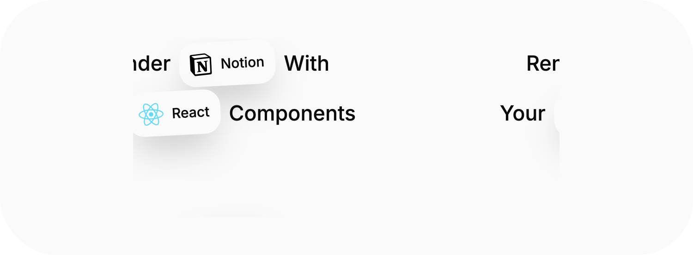

# @wanner.work/notion.

The all-in-one toolkit to build React applications using Notion as your CMS.

[Visit the documentation at https://notion.wanner.work/ !](https://wanner.work/notion)

## Features

- **Easy to use**: Simple and intuitive API to get you started quickly.
- **Highly customizable**: Flexible configuration options to tailor the rendering to your needs.
- **Supports all Notion blocks**: Render all types of Notion blocks, including text, images, lists, and more.
- **TypeScript support**: Fully typed with TypeScript for better developer experience.
- **Open source**: Free and open source under the MIT license.
- **Small bundle size**: Optimized for performance with a minimal footprint.
- **Server-side rendering**: Compatible with Next.js and other SSR frameworks.

## Installation 

```bash
pnpm add @wanner.work/notion
```

## Quick Start

```tsx
import Notion, { NotionQuery } from '@wanner.work/notion';

// on server side
const query = new NotionQuery(process.env['NOTION_INTEGRATION_TOKEN']!);
const data = await query.retrievePageData('your-notion-page-id');

// in react component
return <Notion data={data} />;
```